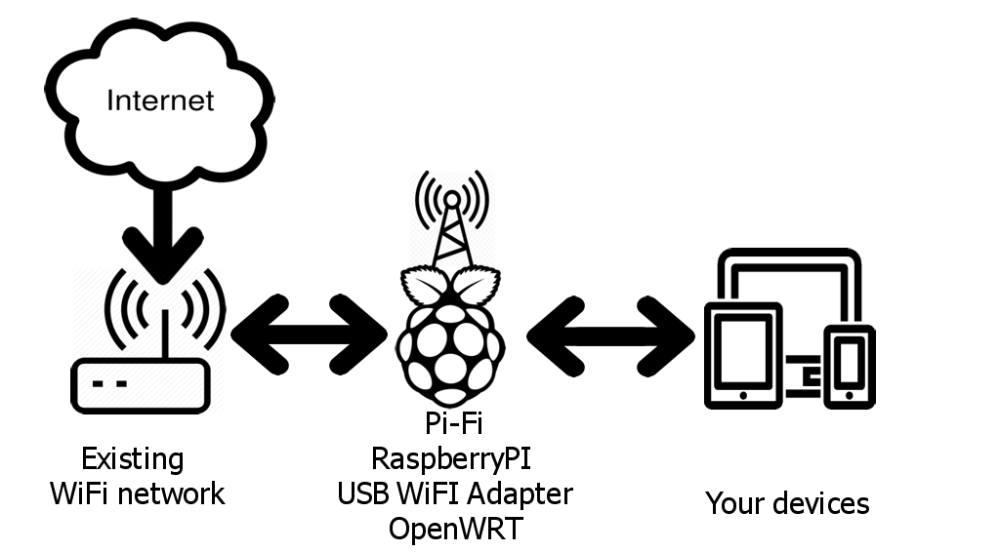
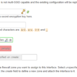
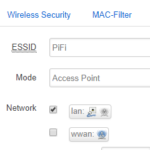

+++
date = '2018-08-01T10:00:35+01:00'
draft = false
title = 'Project Pifi Raspberripi as Travel Router'
image = 'hero_image.jpg'
categories = ["Projects", "Technology"]
tags = ["Travel"]
+++
# The problem…

While traveling around and visiting some nice remote campgrounds it sometimes occurs that there is only WiFI at the central building, or it is limited to 1 device only. And if you don’t have much mobile data… Problem!  
In rare occasions it also happens that cellphone reception is quite eh, non existent 🙂  
Even with my limited internet usage during holidays I’d like to search/plan trips or send some pictures to family and friends to make them jealous.

# The solution!

Connect the RaspberryPI to the existing network. Setup an accesspoint Pi-Fi. Connect your devices to your Pi-Fi.

# Requirements

- Raspberry Pi
- USB WiFi dongle
- microSD card
- Micro USB power adapter
- Network cable for initial configuration
- SSH client (e.g. PuTTY)

It is recommended to use a Raspberry Pi 3 or newer, these versions have one WiFi adapter built in. Additionally you need one USB WiFi dongle. If you are using an older Raspberry Pi you will need two.

# USB WiFi dongle

I have bought the “[600Mbps Dual Band 2.4/5Ghz Wireless USB WiFi Network Adapter Antenna 802.11](https://www.ebay.com/itm/600Mbps-Dualband-WiFi-Adapter-Dongle-WLAN-Stick-IEEE-802-11b-g-150Mb-USB-2-0/222871146804?hash=item33e427d134)” on eBay for less than 3 euro.

This adapter has a MediaTek (Ralink) mt7601u chipset. The chipset used in this adapter is supported by OpenWRT/LEDE. There is a small external antenna and it has an SMA connector (I hope this is the correct name!) so replacing it with a better antenna should be possible.

The USB dongle will be used to receive the existing WiFi network, while the Raspberry Pi itself will host your own WiFi network, for the fun called Pi-Fi. Having a large antenna will hopefully result in a stable connection with the existing network 🙂

It doesn’t really matter which WiFi dongle you buy, as long as the chipset is supported in OpenWRT/LEDE. And no, having Linux support doesn’t guarantee this!

# OpenWRT/LEDE

Download the Raspberry Pi image from the [OpenWRT/LEDE website](https://openwrt.org/toh/raspberry_pi_foundation/raspberry_pi). The current version is 17.01.4 LEDE. Choose the correct image, for the Raspberry Pi 3: rpi-3-ext4-sdcard.img.gz. Flash the image with a tool such as [Etcher](https://etcher.io) to a microSD card. Once you are done flashing the image insert it to your Raspberry Pi and power it on.

You need to give your computer a temporary static IP address in the 192.168.1.x range. If your current network is already in the 192.168.1.x range it is advised to connect your computer directly to the Raspberry Pi, or be sure that no other device (mostly routers) is using 192.168.1.1.

Once you are ready go to <http://192.168.1.1> and click the login button and set a password.

Now go to the page **Network > Wireless**  
You will probably only see one wireless adapter because OpenWRT/LEDE doesn’t include many drivers. To get internet on your Pi-Fi we will need to join an existing WiFi network, which will be our Wireless WAN, or wwan.

On the wireless page you should see at least 1 adapter, the internal wireless adapter. “Generic MAC80211 802.11bgn (radio0)”. Click on the “Scan” button. Find your WiFi network and click “Join Network”. Enter the WPA passphrase if required. Be sure that “Create / Assign firewall-zone” is set to wan. Click “submit” followed by “Save & Apply”. Sometimes it is required to reboot to get internet working. Go to **System > Reboot**.

## Drivers

Login via SSH (192.168.1.1) with username root, and your password.

Update the package list:  
opkg update

Optional: I find it usefull to have an extra package ‘usbutils’ installed, which provides ‘lsusb’ among some other tools.  
opkg install usbutils

In this example the USB adapter is using a mt7601u chipset, so let’s go ahead and install the drivers and load the module.

opkg install kmod-mt7601u  
This will also install the kmod-mac80211 and mt7601u-firmware packages. The driver is installed but not yet loaded.

modprobe mt7601u

If you are lucky your adapter is now recognized and added to the wireless config file automatically. Go back to the webinterface and go the page **Network > Wireless**. If there are two adapters everything is okay. And sometimes it is required to reboot.

If you still don’t see the adapter after a reboot please login via SSH again.  
cd /etc/config  
mv wireless bak.wireless # To create a ‘backup’  
wifi config > wireless # Writes a new ‘wireless’ file.  
Optional: Restart Luci webinterface via “/etc/init.d/uhttpd restart”.

# The config

In the webinterfe go to the page **Network > Wireless**.  
There are two devices: radio0 and radio1. The radio0 device is your internal wireless adapter and radio1 is the USB wireless adapter.  
I suspect the internal wireless adapter to be less strong due to a smaller antenna, so I prefer to use the internal adapter as hotspot, while the USB adapter with a larger/stronger antenna is being used to connect to the existing wireless network.

## Setup your Pi-Fi hotspot

In the radio0 section click the “Edit” button.  
Change **Mode** to “Access Point” and **Network** to “lan”. If you want your hotspot to be private you can change this in the tab “Wireless Security”. Click “Save & Apply” to eh.. save and apply the settings. What else did you expect? 🙂

## Joining existing wireless network

Now we can join the existing wireless network with our USB adapter. In the radio1 section click the “Scan” button and join your wireless network.

I often see the message “Wireless is disabled or not associated”. The easiest and quickest method to fix this seems to be the magical reboot. So once again perform a reboot if this happens.

## Change the IP range

The 192.168.1.x range is quitte popular as a private network range. To prevent potential issues I’d like to change this to something less common.  
In the webinterface go to the page **Network > Interfaces**.  
Edit the LAN interface and change “IPv4 address” to 10.13.37.1. Yes, very 1337 indeed… After you click on “Save & Apply” you can change your computers static IP address back to DHCP, or a static address in the 10.13.37.x range.

# While on the road

Every time you visit a place and want to use your Pi-Fi as personal hotspot you will need to join the wireless network. As far as I know you can’t save multiple wireless networks. So when you revisit an old location you need to reconnect your Pi-Fi to the existing network.

So connect your device to your Pi-Fi network, open your browser and go to the webinterface (Now listening at <http://10.13.37.1>) and follow the steps described in “Joining existing wireless network”.
