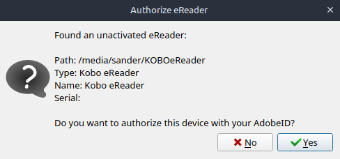

+++
date = '2026-08-05T19:22:46+02:00'
draft = false
title = 'E-Books Lenen op Linux'
image = 'hero_image.jpg'
categories = ["Technology"]
tags = ["E-Book", "Linux"]
toc = "true"
+++
## Boeken lenen bij de bibliotheek op Linux besturingssystemen
Als je e-books bij bijvoorbeeld de bibliotheek wilt lenen, krijg je vaak te maken met een Adobe DRM beveiligd boek.
Of ja, boek. Je krijg eerst een URLLink.acsm bestand waarmee je het DRM beveiligde boek kan downloaden.
De standaard methode hiervoor is om Adobe Digital Editions te gebruiken.

Zolang je Windows gebruikt geen enkel probleem. Maar ben je een Linux gebruiker? 
Het draaien van Adobe Digital Editions via [wine](https://winehq.org) is geen enkel probleem. De authorisatie werkt, URLLink.acsm bestand openen werkt. Hoef je alleen nog maar de ePub te kopieren naar de e-reader en klaar... Zolang je e-reader geauthoriseerd is.
En daar kwam ik achter toen ik mijn Kobo e-reader naar fabrieksinstellingen had hersteld.

## De e-reader authoriseren
In Windows kan je de e-reader met de computer verbinden en in Adobe Digital Editions het apparaat selecteren en authoriseren.
Via wine kreeg ik mijn e-reader echter niet te zien. Geen authorisatie? Geen geleende boeken.

Installeer [Calibre](https://calibre-ebook.com), en download de [DeACSM plugin](https://github.com/Leseratte10/acsm-calibre-plugin/releases). 
Nadat Calibe is gestart ga je naar *Preferences > Plugins > Load Plugin from file*. Selecteer nu DeACSM_0.0.16.zip. Herstart Calibre na installatie van de plugin.

## Plugin authoriseren
Ga naar *Preferences > Plugins* en dubbelklik op DeACSM. (Onder "File type > DeACSM")
Kies de optie "Link to ADE account". Login met uw ByteBooks account. (Opvolger van Adobe ID) Laat de emulatie op ADE 2.0.1 staan.

Onderstaande is een experimentele functie in DeACSM v0.0.16 en werkt alleen voor e-readers die de (verborgen) map .adobe-digital-editions hebben. Op mijn Kobo Clara 2E geen probleem.
Kies de optie "Authorize eReader over USB". Verbind nu de e-reader met je computer.

Afhankelijk van uw Linux distributie, is het pad /media/ of /run/media/ gevolgd door gebruikersnaam/KOBOReader*

Op een Kobo e-reader kan je de status controleren bij *Meer > Instellingen > Accounts > Adobe*. 

## Geen Adobe Digital Editions meer nodig
Dus nu terug naar Adobe Digital Editions om URLLink.acsm bestanden te openen? Kan. Werkt ook.
Maar nog beter: Met de DeACSM plugin kan je deze bestanden nu direct openen in Calibre!
Klik op "Add books" en selecteer het URLLink.acsm bestand. Na enkele seconden verschijnt het gedownloade boek in je Calibre library.

## ePub naar de e-reader
Je kan nu het ePub bestand naar je e-reader kopieren. Hiervoor zijn meerdere methodes.

1. **Handmatig**

    De standaard locatie is /home/username/Calibre Library/auteur/boek/
    Verbind je e-reader met een kabel en open je file manager. Kopieer het epub bestand handmatig naar je ereader.

2. **Via Calibre**

    Sluit je e-reader via een kabel aan op de computer. Na enkele seconden verschijnt in Calibre de knop "Send to device".
    Selecteer een of meerdere bestanden in Calibre. Send to device.

3. **Via Kobo Cloud plugin**

    Via[Kobo Cloud](https://github.com/fsantini/KoboCloud) synchroniseer ik mijn Kobo e-reader. Dit kan o.a. vanaf Nextcloud, Google Drive of Dropbox. 
    In Google Drive heb ik een gedeelde map eBooks. In Calibre heb ik de Library locatie aangepast naar deze map. Alles wat in Calibre staat wordt hierdoor automatisch gesynchroniseerd naar Google Drive, en via de Kobo Cloud plugin weer naar mijn e-reader.

4. **Direct via Dropbox integratie (Kobo)**

    Een aantal Kobo e-readers hebben directe ondersteuning voor Dropbox. 
    Zie [Kobo Help](https://help.kobo.com/hc/nl/articles/360033830114-Boeken-toevoegen-aan-je-eReader-met-Dropbox) voor meer informatie.

    Ook bij deze methode zou je de Calibre Library locatie kunnen aanpassen naar je Dropbox folder. (Waarschijnlijk /home/username/dropbox/Apps/Rakuten Kobo/)
    Zelf gebruik ik deze methode niet, dus ik weet niet zeker of het werkt met de submappen die Calibre aanmaakt.

Methodes 3 en 4, de Library "in de cloud" zetten worden door Calibre niet aangeraden, maar werken wel. Op eigen risico.

## DRM blijft behouden
Deze methode verwijderd DRM niet. Dat is ook niet het doel van DeACSM.
Daar zijn andere methodes voor. Dus netjes je geleende boek virtueel terugbrengen nadat hij is verlopen!
