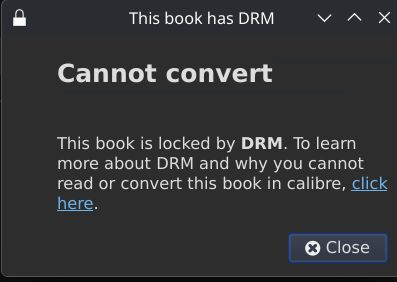

+++
date = '2026-08-07T09:14:31+02:00'
draft = false
title = 'E-Books omzetten naar kepub'
image = 'hero_image.jpg'
categories = ["Technology"]
tags = ["E-Book"]
toc = "true"
+++
## ePub mist afbeelding op Kobo
Al jaren loop ik tegen het probleem aan dat bij de bibliotheek geleende e-Books in het .epub formaat geen omslagafbeelding laten zien op mijn Kobo e-reader. Dit terwijl bijvoorbeeld Calibre de omslagafbeelding wel laat zien.
Gekochte boeken bij  werken wel. Zover ik weet komen die direct uit de  en zijn dat onderliggend kepub bestanden en geen epub.
En daarin zit het verschil.

Het formaat kepub, niet geheel verrassend Kobo ePub, werkt net iets beter op Kobo e-readers dan normale ePub bestanden.
Waaronder werkende omslagafbeeldingen.

## DRM Beveiliging
Net zoals in [E-Books Lenen op Linux](/2026/08/05/e-books-lenen-op-linux/) maken we gebruik van [Calibre](https://calibre-ebook.com).

Wil je nu naar een ander bestandsformaat converteren krijg je te maken met de DRM beveiliging.

Alleen... mag je de DRM beveiliging omzeilen?
Diverse bronnen halen de  aan.
>Degene, die doeltreffende technische voorzieningen omzeilt en dat weet of redelijkerwijs behoort te weten, handelt onrechtmatig.

Kortgezegd: Nee, DRM beveiliging mag je niet verwijderen. Ook niet voor eigen gebruik.
Daarom geen directe linkjes in dit artikel, maar alleen de theorie.

## Plugins
De Calibre plugin DeDRM kan de beveliging van boeken verwijderen.
Je hebt ook de in het vorige artikel geinstalleerde en geauthoriseerde [DeACSM](/2026/08/05/e-books-lenen-op-linux/#plugin-authoriseren) plugin nodig. 

### DeASCM
Waarschijnlijk kan DeDRM de encryptie key automatisch vinden en is het niet nodig om de encryption key handmatig te exporteren uit DeACSM.

Indien DeDRM in de volgende stap de encryption key niet automatisch vind, moeten we deze eerst even exporteren. 
Ga naar *Preferences > Plugins* en dubbelklik op **DeASCM**. (Onder "File type > DeDRM")

Klik op de knop "Export account encryption key". Sla het *.der bestand op.

### DeDRM
Nadat Calibe is gestart ga je naar *Preferences > Plugins > Load Plugin from file*. Selecteer nu het DeDRM zipbestand. Herstart Calibre na installatie van de plugin.
Ga naar *Preferences > Plugins* en dubbelklik op **DeDRM**. (Onder "File type > DeDRM")

Klik op de knop "Adobe Digital Editions ebooks". 
- **Automatisch** 
  Klik op het + knopje en de key wordt geimporteerd.
- **Handmatig** 
  Indien de key niet automatisch wordt gevonden, klik op de knop "Import Existing Keyfile" en selecteer het in de vorige stap geexporteerde *.der bestand.

## ePub omzetten
De DeDRM plugin doet zijn werk automatisch bij het toevoegen van nieuwe boeken.
Als het boek voor de installatie van de DeDRM plugin al in Calibre stond, verwijder deze dan eerst uit Calibre.
Doe dit door het boek te selecteren, rechtermuisknop: "Remove Books > Remove selected books".

Voeg het boek opnieuw toe in Calibre via de knop "Add books". Dit kan door wederom het URLLink.acsm te importeren of een bestaand ePub bestand.

Selecteer nu het boek en klik op de knop "Convert books".
Rechtsbovenin verander je "Output format" van EPUB naar KEPUB.

Calibre kan heel veel veranderen aan e-books, zoals bijvoorbeeld het standaard font of lettergrote aanpassen. Zelfs woorden vervangen in boeken is mogelijk. Ooit eens een personage met een heel irritante naam een betere naam gegeven op deze manier.
Dit is voor deze stap allemaal niet nodig.

Klik rechtsonder op "OK" en het bestand wordt geconverteerd.

## kepub naar de e-reader

Volg hiervoor dezelfde stappen zoals beschreven in [ePub naar de e-reader](/2026/08/05/e-books-lenen-op-linux/#epub-naar-de-e-reader).