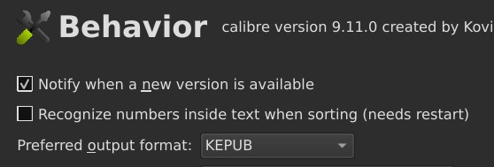
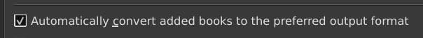
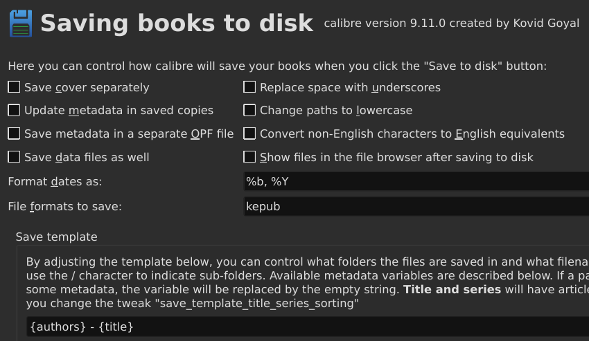
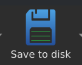

+++
date = '2026-08-08T08:46:01+02:00'
draft = false
title = 'e-Books via Calibre automatiseren'
image = 'hero_image.jpg'
categories = ["Technology"]
tags = ["E-Book"]
toc = "true"
+++
## Intro
In het vorige artikel [ePub omzetten naar kepub](/2026/08/07/e-books-omzetten-naar-kepub/) is beschreven hoe je op een Kobo e-reader weer omslagafbeeldingen krijg. En in [ePub naar de e-reader](/2026/08/05/e-books-lenen-op-linux/#epub-naar-de-e-reader) leg ik twee methodes uit om de boeken via de cloud te synchroniseren. Hiervoor synchroniseer ik de gehele Calibre Library naar Google Drive. Zoals beschreven is dat echter niet aangeraden door Calibre.

Inmiddels heb ik wat nieuwe inzichten en is mijn werkwijze veranderd. Meer handelingen automatiseren, minder handwerk!
In onderstaande stappen gaan we automatisch epubs converteren naar kepub, en slaan we die op in een map die met een cloud opslagprovider wordt gesynchroniseerd. Deze laateste stap kan je uiteraard ook doen als je alleen met ePub bestanden werkt, zonder deze bestanden eerst te converteren.

## Automatisch converteren naar kepub
Stel eerst het gewenste output formaat in op kepub. Ga naar *Preferences > Interface > Behavior*.
 
Ga nu naar *Preferences > Adding books > Adding Actions*.

Nieuw toegevoegde boeken worden nu automatisch geconverteerd naar kepub. 

## Kobo Cloud plugin / Dropbox
Mijn oude werkwijze synchroniseerde de gehele Calibre Library. Dit hield ook in dat alle boeken zowel in epub als kepub op mijn e-reader gezet werden. Niet ideaal.
We laten nu de Calibre Library staan op de orignele locatie. Alleen de kepub gaan we opslaan in een map die in de cloud staat.

De [Kobo Cloud](https://github.com/fsantini/KoboCloud) plugin werkt o.a. met NextCloud, Google Drive of Dropbox.
De configuratie van NextCloud of Google Drive zijn voor de meeste mensen de simpelste oplossing.
Installeer en configureer de plugin volgens de instructies.

Dropbox via deze plugin is wat ingewikkelder. Sommige Kobo e-readers hebben echter standaard Dropbox ondersteuning. Kijk hiervoor op de [Kobo Help](https://help.kobo.com/hc/nl/articles/360033830114-Boeken-toevoegen-aan-je-eReader-met-Dropbox) pagina.

## Save to Disk
Ga naar *Preferences > Saving books to disk*. 

Standaard staan bijna alle opties aan. Voor ons doel, synchroniseren van alleen e-books, is dat niet nodig.
Zet daarom alle opties uit die je niet nodig vind.
De belangrijkste optie is hier echter "File formats to save". Zonder filter slaat Calibre namelijk het orignele epub bestand en het geconverteerde kepub bestand op. En dat willen we juist voorkomen.

Daarnaast willen we, in geval van synchronisatie via NextCloud, geen submappen. Pas daarom de template aan naar iets zonder/slashes/in/de/naam. Dat worden anders automatisch submappen.
Ik heb gekozen voor **{authors} - {title}**.

## Opslaan en synchroniseren
Nu alle instellingen goed staan kunnen we de (automatisch) geconverteerde kepub bestanden gaan opslaan in je gekozen en reeds geconfigureerde cloud map.

Selecteer in Calibre één of meerdere bestanden en klik op de "Save to Disk" knop.

Navigeer naar de locatie waar je (Google Drive/NextCloud/Dropbox) bestanden staan, en kies de map die je geconfigureerd hebt in Kobo Cloud.

Na enkele seconden staan je kepub bestanden in je cloudomgeving.
Synchroniseer nu de e-reader, en de bestanden worden automatisch geimporteerd.