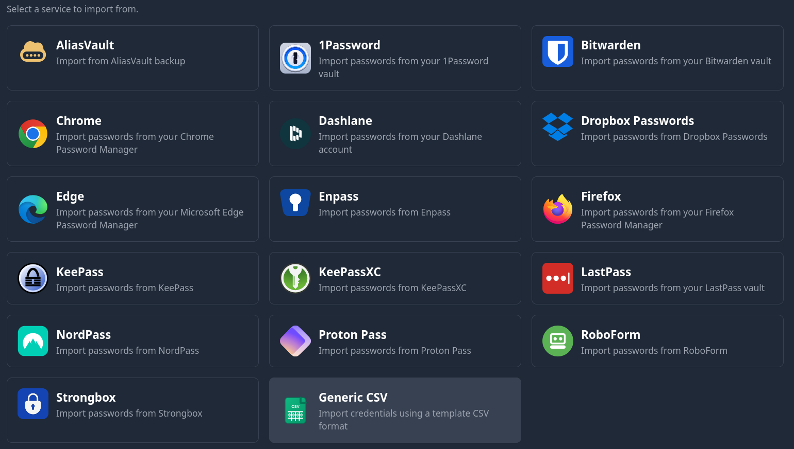
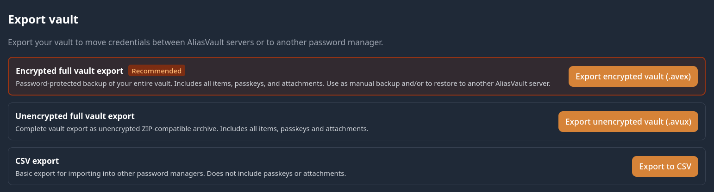

+++
date = '2026-08-13T11:35:56+02:00'
draft = false
title = 'AliasVault Password Manager'
image = 'hero_image.jpg'
categories = ["Technology","Projects"]
tags = ["Privacy","Password","Docker"]
toc = "true"
+++
## AliasVault

Wie op internet rondhangt is wel bekend met wachtwoorden. Hopelijk gebruik je hiervoor al een wachtwoordmanager om iedere login een uniek wachtwoord te geven.
Zelfs de wachtwoordmanager van de browser is al beter dan geen wachtwoordmanager.

Zelf ben ik lang geleden begonnen met [Keepass](https://keepass.info). Inmiddels weer enkele jaren geleden volledig overgestapt op [BitWarden](https://bitwarden.com).
En sinds kort maak ik gebruik van [AliasVault](https://www.aliasvault.com).

Leuk feitje: Dit is een Nederlands product, en de [broncode](https://github.com/aliasvault/aliasvault) is openbaar.

### Features
De [basicfuncties](https://www.aliasvault.com/features) van AliasVault zijn zoals je kan verwachten van een moderne wachtwoordenmanager.
- Wachtwoorden of 'wachtwoordzinnen' (passphase)
- Passkey ondersteuning
- 2FA / Tweestapsverificatie

Daarnaast de unieke functies in AliasVault:
- (Optioneel) ingebouwde (ontvangende) mailserver
- E-mail aliassen genereren
- Willekeurige persoonsgegevens genereren

## Privacy door Aliassen
Wat AliasVault uniek maakt is het concept van aliassen.

Je kan voor iedere website eenvoudig een uniek e-mail adres genereren.
Tevens kan je ervoor kiezen om eenvoudig willekeurige persoonsgegevens te maken. Deze optie geeft je een voor/achternaam, gender en geboortedatum.

Waarom heeft de bakker op de hoek voor zijn spaarpuntenkaart mijn echte e-mail nodig? Of uberhaupt mijn naam. In de meeste gevallen zijn deze gegevens nergens voor nodig.

## E-mail alias
Je kan een e-mail alias op 2 manieren aanmaken.
- Via een eigen (sub)domein 
  Dit werkt momenteel alleen via een Self-Hosted AliasVault server. 
- Via de hosted AliasVault 
  Random aliasvault.net adressen. 

De veiligste optie is via een eigen (sub)domein. Je bent dan minder afhankelijk van een externe partij.

### AliasVault SMTP of catch-all
Met een eigen (sub)domein maak je de keuze om de ingebouwde SMTP server te gebruiken, of je laat alle e-mail in een catch-all mailbox binnenkomen. Als je kiest om e-mail via AliasVault af te handelen: E-mails worden encrypted opgeslagen en alleen leesbaar voor de gebruiker zelf. De admin kan de inhoud niet lezen.

Heb je meerdere gebruikers dan is de ingebouwde SMTP server aan te raden: Gebruikers kunnen binnenkomende mail lezen via de AliasVault client. Het is niet mogelijk om de binnekomende e-mail in een extern mailprogramma te lezen. Wil je dit wel, of kunnen benantwoorden op e-mails, dan kan je kiezen voor een catch-all mailbox waarop alles binnenkomt.
> [!NOTE]
> Ben je enig gebruiker is een catch-all mailbox geen probleem, met meerdere gebruikers moet je je wel bedenken dat iedereen die je toegang geeft dan alle mail kan zien die daarop binnenkomt.

## Beginnen met AliasVault 
Wil je snel de functies uittesten dan is de door [AliasVault gehoste versie](https://app.aliasvault.com) het makkelijkst. Heb je een eigen domein, en ervaring met [self-hosting en/of Docker](https://docs.aliasvault.com/installation/) dan zou ik deze methode adviseren.

Uiteraard ontbreekt het niet aan [browser plugins](https://www.aliasvault.com/platforms#browser-extensions) en 
[mobiele apps](https://www.aliasvault.com/platforms#mobile-apps).

### AliasVault importeren
Als je al gebruik maakt van een wachtwoordmanager is de kans groot dat je deze direct kan importeren.
Hiervoor dien je in je huidige wachtwoordmanager eerst een export te maken. Hoe dit moet staat vast uitgelegd in de documentatie van je wachtwoordmanager. 
Staat je wachtwoordmanager er niet bij, kijk dan of je kan exporteren naar een generiek CSV bestand.

### AliasVault exporteren
Ook kan op ieder moment je wachtwoordenkluis exporteren, bijvoorbeeld als je wilt overstappen naar een andere wachtwoordmanager of besluit om van de hosted AliasVault over te gaan op je eigen AliasVault server.

> [!TIP]
> Het is raadzaam om af en toe een export te maken als backup van je gegevens.