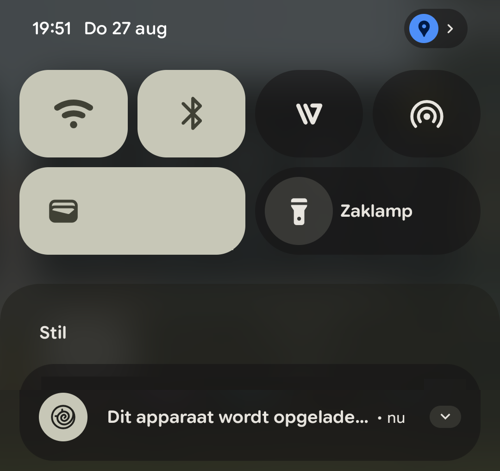
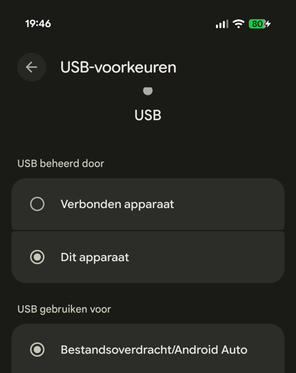
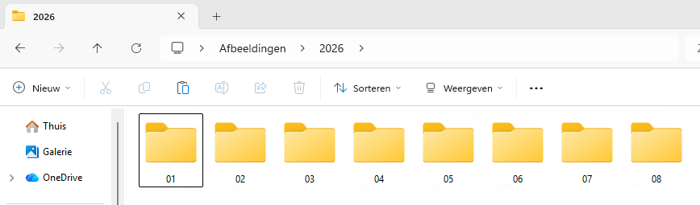
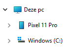
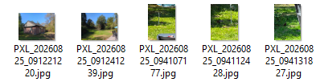

+++
date = '2026-09-02T15:00:00+02:00'
draft = false
title = 'Fotos kopieren vanaf de telefoon'
image = 'hero_image.jpg'
categories = ["Digitaal Café"]
tags = ["Help"]
toc = "true"
url = "/help/:slug/"
+++

## Introductie
Grofweg gezegd zijn er 2 manieren om foto's en video's naar een computer te kopieren.
De makkelijkste methode is gebruik maken van een cloud oplossing. De andere methode is via een USB kabel. Uiteraard kan je ook beide tegelijk gebruiken.

Er zijn meer methodes, maar die zijn vaak wat ingewikkelder.

> [!NOTE] Opmerking
> Bedenk goed of u uw foto's in de cloud van een bedrijf wilt neerzetten. Denk hierbij bijvoorbeeld aan uw privacy, kunnen uw foto's worden gebruikt door bijvoorbeeld AI, of eventuele kosten als u meer opslag nodig heeft dan de gratis variant.

## Via cloudopslag
Er zijn diverse aanbieders van cloudopslag. Op Android telefoons is dit meestal [Google Fotos](https://photos.google.com), op Apple iOS [iCloud](https://icloud.com). Uiteraard kan men ook gebruik maken van bijvoorbeeld [Microsoft OneDrive](https://www.microsoft.com/nl-nl/microsoft-365/onedrive/online-cloud-storage) of [Dropbox](https://dropbox.com).

Deze aanbieders hebben allemaal een gratis optie, deze is echter wel beperkt in opslag. Voor een relatief klein bedrag kan je extra opslag bijkopen. Reken op ongeveer 1-2 euro per maand.

Het is ook mogelijk om een eigen "cloud" op te zetten. Dit kan worden gedaan via een zogenaamde NAS (netwerk-hardeschijf). Dit is echter voor de gevorderde gebruiker, en je hebt te maken met hoge initiële kosten. Voor meer informatie zie [Backups: Netwerk hardeschijf (NAS)](/help/backups/#netwerk-hardeschijf-nas)

### Google Fotos
Als u nog geen gebruik maakt van Google Fotos of deze nog niet is ingesteld kijk dan op de pagina [Backups: Google Fotos](/help/backups/#google-fotos).

Als uw foto's en video's geupload zijn naar Google Fotos kunnen ze nu gedownload worden naar uw computer. Deze methode werkt het beste als u (sporadisch) enkele bestanden nodig heeft, niet voor een volledige kopie.

- Ga naar [Google Fotos](https://photos.google.com) (Login indien nodig.)
- Ga met uw muis over de voorbeeldweergave heen
- Zet een vinkje in het selectievakje. (Vinkje wordt blauw)
  - Selecteer op deze manier één of meerdere foto's en/of video's om te downloaden.
- Klik rechtsbovenin op de 3-puntjes en kies Download (Of gebruik de toetsencombinatie Shift+D)

Als u meerdere bestanden heeft geselecteerd wordt er een ZIP archiefbestand gemaakt met daarin alle bestanden. Heeft u een enkel bestand geselecteerd dan download deze direct.
Sla het bestand in een makkelijk terug te vinden map op. Bijvoorbeeld in de map Afbeeldingen.

### Apple iCloud
De backup optie werkt officieel alleen met Apple telefoon's en tablets. Het downloaden van de foto's en video's kan echter wel op iedere computer.

- Ga op uw computer naar [iCloud Fotos](https://www.icloud.com/photos) (Login indien nodig.)
  - Selecteer uw foto's en/of video's. (ctrl-klik)
  - Klik op het ***wolk-icoontje*** om de bestanden te downloaden.
- Download [iCloud for Windows](https://support.apple.com/en-us/103232)
  - Login met uw Apple Account.
  - Activeer minimaal iCloud Fotos synchronisatie.
  - Nadat de configuratie compleet is worden de bestanden gesynchroniseerd.
  - Bestanden zijn hierna te vinden in C:\Gebruikers\\[uw naam]\Afbeeldingen\iCloud-foto's\Foto's\

Voor meer informatie kijk op de pagina [Backups: iCloud](/help/backups/#apple-icloud)
 
## Met een kabel
Hiervoor is een USB kabel met data-ondersteuning nodig. Niet iedere kabel heeft dit!
Gebruik bij voorkeur de USB kabel die bij uw telefoon zat.

### Telefoon instellen op bestandsoverdracht
> [!NOTE] Opmerking
> Tussen verschillende fabrikanten en soms ook binnen verschillende modellen van één fabrikant kunnen onderstaande opties er iets anders uitzien of een licht afwijkende naam hebben.

Veeg met uw vinger vanaf de bovenkant van het scherm naar beneden. Als er meerdere notificaties open staan kan het zijn dat u iets naar beneden moet scrollen. 

Tik op ***Dit apparaat wordt opgeladen***. Selecteer ***Bestandsoverdracht***. Deze keuze geldt alleen voor deze verbinding en moet de volgende keer opnieuw worden gemaakt. 

Ter bevestiging wordt er gevraagd om uw beveiligingscode.
Dit kan een pincode, vingerafdruk of gezichtsscan zijn, afhankelijk wat u heeft ingesteld.

### Mappenstructuur
Voordat we alle foto's en video's op één grote hoop gooien is het raadzaam om na te denken over een mappenstructuur.
U bent vrij om alles in te delen zoals u wilt. Enkele voorbeelden.

| **Structuur** | **Map** |
| ----- | ----- |
| Jaar\Maand        | 2026\08\ |
| Onderwerp         | Sport\ |
| Onderwerp - Jaar  | Vakantie Oostenrijk - 2026\ |
| Jaar - Onderwerp  | 2026 - Vakantie Oostenrijk\ |
| Combinatie        | Sport\Tennis\2026\ |

Er is geen goed of fout, zolang de indeling voor u werkt.
Mijn persoonlijke voorkeur is ***Jaar\Maand*** voor het gros van de afbeeldingen. Afgewisseld met ***Jaar - Onderwerp*** voor bijvoorbeeld vakanties.

Open Windows Verkenner (Toetsencombinatie Win+E) en ga naar de locatie waar u de bestanden wilt plaatsen, bijvoorbeeld de standaard map "Afbeeldingen" en maak hierin een mappenstructuur.
Klik met uw rechtermuisknop en kies voor ***Nieuw > Map***.

Het resultaat van deze indeling.

### Bestanden kopieren
In dit voorbeeld ga ik uit van de mappenstructuur ***Jaar\Maand***. Momenteel 2026\08. We gaan nu ook alleen bestanden selecteren die in deze maand gemaakt zijn.

- Aan de linkerkant van Windows Verkenner ziet u uw telefoon. Dubbelklik op de naam. 
  
- Navigeer vervolgens naar ***Interne gedeelde opslag > DCIM > Camera***.
- De bestandsnamen zijn meestal opgebouwd in jaar-maand-dag-tijdstip. Onderstaand voorbeeld: PXL_20260825_tijd.jpg 
  
- Door de opbouw van de bestandsnaam kan je eenvoudig alle bestanden uit 1 maand herkennen en selecteren.
- Selecteer het eerste bestand waarvan de naam begint met 202608xx_yy. 
- Zoek, maar nog niets selecteren! het laatste bestand van deze maand, 202608xx_yy.
- Druk nu op de Shift-toets, en klik op het laatste bestand.
- Alle tussenliggende bestanden worden nu automatisch geselecteerd.
- Klik met de rechtermuisknop op één van de geselecteerde bestanden en kies "Kopieren".
- Open nu achtereenvolgens de map ***Afbeeldingen > 2026 > 08***.
- Rechtermuisknop op een leeg gedeelte: Plakken.

Herhaal bovenstaande stappen per Jaar/Maand, of welke indeling u gekozen heeft. De volgende keer kunt u eenvoudig verder door dan alle bestanden met de naam 202609xx_yy te selecteren.

## Backup
U heeft nu de foto's en video's zowel op de telefoon als op uw computer en/of cloud omgeving staan. Een goed begin voor uw backups!
Lees meer over [backups](/help/backups/).
